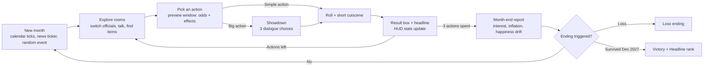

# Kakistocracy: Survive the Term — Game Plan v0.6

> Satirical political management adventure. Isometric rooms in a cozy dollhouse style (think *The Sims*), *Maniac Mansion*-style exploration, *Shining Force*-style screen layout and menus — including actual *Shining Force*-style tactical battles for Declare War. Built for the web in React.
> Numbers are starting values, meant to be tuned in playtesting.

**What changed since v0.5**
- **Renamed the game**, working title "Make America Go Away (MAGA)" → **Kakistocracy: Survive the Term** — the old title was a vibe with no verb; the new one names the actual win condition (survive your four-year term) and uses the real word for "government by the least qualified," which reads as sharper satire and doesn't collide with an existing film title the way "Idiocracy" (briefly considered) would have. Purely a branding change — no gameplay, data or code-structure changes.

**What changed since v0.4 — Phase 4 (Vertical slice) complete**
- **Real pixel-art sprites** for the 6 US officials and Canada's 6-person battle roster (4 directions each), replacing their coloured-square placeholders everywhere they appear (room camera, official windows, resolution preview, title screen, battle screen). Every other country's roster is still placeholder art — see §16.
- **Random monthly events** (20, weighted by flags) surface in the month-end report and news ticker alongside the month's actions.
- **Midterms and Congress**: a Nov 2026 happiness check can lose Congress, shown with a report banner and a HUD warning; a low-happiness streak afterward is a visible impeachment watch.
- **Save/load**: an autosave after every month, with Continue/New Game on the title screen.
- **Placeholder chiptune audio**: Web Audio blips/jingles for menus, showdown choices, action results, month-end reports and endings, plus a quiet ambient hum on the room/battle screen — all mutable from a corner toggle. Stands in for real music/SFX (§16) until those exist.
- **Title screen polish**: the roster sits in a framed panel with each official's name tag tinted by their old placeholder color, a hover highlight, a brief fade-in, and sound on Start/Continue/New Game.

**What changed since v0.3**
- **Declare War is now a tactical battle**, not an instant roll: *Shining Force*-style turn-based combat on a grid, US officials vs. the target country's lineup, fought out on a dedicated battle screen (see §7.1). Winning/losing the battle *is* the success/fail roll for that action. Three new war-only targets — **Iran**, **Venezuela**, **Russia** — join the original four.

**What changed since v0.2**
- **Art direction pivot: isometric, not top-down 16-bit.** Rooms now render on a 2:1 isometric camera (diamond floor tiles, walls and objects as simple extruded blocks) instead of a flat SNES-style top-down grid — closer to *The Sims*' dollhouse view. This is a camera/rendering change, not a rules change: `engine/movement.ts`'s grid logic is untouched, only `ui/room/` reinterprets the same grid positions. HUD chrome, pixel font and menu conventions are unchanged for now (a future art pass may revisit those too).

**What changed since v0.1**
- **No tactical battles.** *Shining Force* is only the reference for the screen layout (windows, portraits, cross-shaped menu). Actions now resolve with visible success odds and, for the big ones, short dialogue "showdowns".
- **You win by surviving 4 years.** The calendar at the top starts in **January 2024** and the run is won after **December 2027**.
- **New endings:** Bankruptcy, American Revolt (civil war), Nuclear Meltdown, Hyperinflation, Brain Freeze, Impeachment, plus secret ones.
- **New HUD stat: DEFCON**, which drives the Nuclear Meltdown ending.

---

## 0. TL;DR

- **One run = one 4-year term: 48 months, Jan 2024 → Dec 2027.** Survive to January 2028 and you win.
- **Each month you must spend 3 Executive Actions.** The cabinet can't sit still, so "do nothing" is not an option.
- **You explore rooms** (Oval Office, Treasury, Capitol, the Fed, the UN…), switch between 6 officials, and use them on objects and people to trigger actions.
- **Every action is a gamble you can read.** Before confirming, a window shows the success chance and what it will do to the national stats.
- **Six ways to lose:** Bankruptcy, American Revolt, Nuclear Meltdown, Hyperinflation, Brain Freeze, Impeachment.
- **Headlines** are your score. Surviving is the win; how much chaos you caused along the way sets your final rank.

---

## 1. Design pillars

1. **Every action is a visible trade-off.** Clicking "Give $5,000 to every citizen" bumps Happiness and the Debt at once, and inflation creeps up over the next six months. The satire comes from the systems, not just the jokes.
2. **Dumber is stronger (until it isn't).** The most spectacular actions only unlock when Party IQ is *low*. Getting dumber opens up chaos, but IQ 0 ends the run.
3. **Survival under pressure.** You must act every month and the safe options are limited, so you're always pushing your luck on at least one stat.
4. **Short, replayable runs.** A full term takes 1–2 hours. Random events and seeded runs keep each term different.
5. **Cozy sincerity.** Absurd jokes, serious craft: clean isometric rooms (*The Sims*' dollhouse warmth), chiptune, crisp menus.
6. **Punch at public actions, not private people** (see §14).

---

## 2. Core loop



---

## 3. Calendar and win condition

- The top-left of the HUD shows the date: **`JAN 2024`**. Each End Month advances it one month. The start year lives in `data/balance.ts` so it's easy to change.
- **48 months** of play: Jan 2024 → Dec 2027. Surviving the Dec 2027 month-end report wins the game.
- A small **term progress bar** under the date (4 segments, one per year).
- **Year changes** get a title card: "2025 — Year Two. Somehow."
- **Midterms (Nov 2026):** if Happiness is under 45 %, you lose Congress. Capitol actions get harder (−20 % success) and the Impeachment ending becomes possible.

---

## 4. The HUD: national stats

Always visible, top of the screen, in a chunky 16-bit bar. Stats animate when they change (ticking numbers, flashing red/green, a sound).

| Stat | Start | Loss threshold | Notes |
|---|---|---|---|
| **Date** | JAN 2024 | — | Win after DEC 2027 |
| **National Debt** | $40.0 T | **≥ $60 T → Bankruptcy** | Grows every month from deficit + interest. Shown as a spinning debt clock. |
| **Interest Rate** | 3.5 % | — | Drives the cost of the Debt. Lowering it is a showdown at the Fed. |
| **Inflation (official)** | 3.0 % | — | What the government reports. Can be manipulated (fire the statistician). |
| **Inflation (felt)** | 6.0 % | **≥ 25 % → Hyperinflation** | What people feel at the grocery store. **Hidden** (shown as "?? %") unless revealed. This is what drives Happiness. |
| **Party IQ** | 80 | **≤ 0 → Brain Freeze** | A spendable resource. Dumb actions cost IQ; the dumbest *require* low IQ. |
| **Happiness** | 70 % | **≤ 0 % → American Revolt** | Driven by felt inflation, handouts, rallies, wars (short spike, long decay). |
| **DEFCON** *(new)* | 5 | **1 → Nuclear Meltdown** | 5 = calm, 1 = the end. Wars, UN speeches and land grabs push it down; summits and quiet months bring it back up. |
| **Headlines** (score) | 0 | — | Earned by every action. Repeats earn fewer. |

**Also on screen:** Executive Actions left this month (3 gavel icons) and the active official's portrait.

---

## 5. Endings

### Loss endings

| Ending | Trigger | Scene idea |
|---|---|---|
| **Bankruptcy** | Debt ≥ $60 T | "USA Inc. files for Chapter 11." The White House goes up for auction; the debt clock runs out of digits and explodes. |
| **American Revolt (Civil War II)** | Happiness ≤ 0 % | The pixel map of the US cracks along state lines; every state declares itself the "real" America. |
| **Nuclear Meltdown** | DEFCON reaches 1, **or** the reactor-meltdown event fires | Two routes, one ending. War route: the Situation Room phone rings and everyone looks at each other. Reactor route: DOGE cut the nuclear safety team (see Elon). The map glows, cartoon-style. |
| **Hyperinflation** | Felt inflation ≥ 25 % | The "Wheelbarrow Economy": citizens push carts of cash to buy one egg. |
| **Brain Freeze** | Party IQ ≤ 0 | The cabinet forgets how doors work and is trapped in the Oval Office forever. |
| **Impeachment** | Lost Congress at midterms + Happiness < 25 % for 3 months in a row → Senate trial showdown → lose it | Removed from office. (Once per run, Vance's *Heir Apparent* lets you keep playing as President Vance instead.) |

### Victory

**Survived the term** — reach January 2028. Rank from total Headlines:

| Headlines | Rank |
|---|---|
| < 1,000 | *Forgettable* — "Historians confuse you with someone else." |
| 1,000–2,500 | *Memorable* |
| 2,500–5,000 | *Historic* |
| 5,000+ | *Legendary Chaos* — unlocks New Game+ "Third Term?" with harder numbers |

### Secret endings
- **Balanced Budget** — the Debt goes *down* over the term. The cabinet is so confused the game shows a fake crash screen.
- **Elon Buys America** — Debt ≥ $55 T while Elon is on good terms: he offers to buy the country. Accepting ends the game.
- **Capital on Mars** — three successful Mars launches unlock the option to move the capital to Mars.

---

## 6. Economy and tension model

Pure functions in `engine/economy.ts`, fully unit-tested. All constants live in `data/balance.ts`.

```text
effectiveYield  = interestRate + 0.75
                + 0.05 × max(0, debt − 45)          // debt risk premium
                + 0.15 × max(0, feltInflation − 4)  // inflation premium
interestCost    = debt × effectiveYield / 100 / 12
debt           += primaryDeficit (0.06 T/month) + interestCost + actionSpending

inflationTarget = 2.0 + (3.5 − interestRate) × 0.6 + tariffPressure + stimulusPressure
inflation      += (inflationTarget − inflation) × 0.10       // official drifts slowly
feltInflation  += ((inflation + 2.5) − feltInflation) × 0.10 // felt runs ~2.5 pts hotter

happiness      += −0.6 × (feltInflation − 4)   // prices hurt
                + 0.04 × (60 − happiness)      // "people get used to it"
                + actionEffects

DEFCON         += +1 after 4 months with no escalation (max 5)
```

**Delayed effects** make it feel real: a stimulus check gives Happiness now and inflation over the next 6 months; tariffs bring revenue now and higher prices over 3 months. The engine keeps a queue of pending effects and applies them at each month-end.

### Simulation results (5,000 runs per player type)

I simulated the rules above with 16 simplified actions and a random event each month:

| Player type | Survives 4 years | How they usually lose |
|---|---|---|
| Doesn't read the HUD (random actions) | ~0 % (dies around month 17) | Nuclear Meltdown, then Revolt |
| Careful, and can spam safe actions | ~100 % | — (too easy) |
| Careful, safe actions limited to once/month, 10 % reckless picks | ~28 % | Revolt, Nuclear, Bankruptcy |
| Same, 20 % reckless picks | ~5 % | Nuclear, Revolt, Bankruptcy |

**Takeaways for tuning:**
- The model works: all the main endings show up, and how carefully you play clearly changes the outcome.
- **Safe actions (Read a Briefing, Summit, Rally) must be limited to once per month each**, otherwise the game is trivial.
- The "10 % reckless" line is currently too punishing for a normal player. Aim for about 50–60 % survival on Normal (start by softening random events and war happiness decay), and use difficulty modes (Intern / Normal / Third Term) to move the numbers.
- Brain Freeze and Hyperinflation almost never trigger yet. They need tuning so every ending is reachable.
- A balance script (`scripts/simulate.ts`) will repeat this on the real game data after every change.

---

## 7. How actions work

### Monthly rules
- **3 Executive Actions (EA) per month, all must be spent.** Some big actions cost 2.
- **Each official can act once per month** (Trump twice). Who you send matters, and you'll switch characters often.
- **Safe actions are once per month each** (Read a Briefing, Summit, Rally).
- Walking, talking, searching and using items are free.

### Success chance
Every action shows its odds before you confirm:

```text
success % = base
          + specialty bonus   (+15 to +25 if the official is the right one for it)
          + room bonus        (+10 if done in the action's home room)
          + IQ modifier       (dumb actions: +1 % per 4 IQ below 80 · smart actions: the reverse)
          + items / flags
clamped to 5 %–95 %
```

- **Success:** full effects and full Headlines.
- **Failure:** a backfire version (usually costs Happiness or IQ and still makes the news, just worse news).

### Showdowns (for the big actions)
Contested actions (lower rates at the Fed, pass a bill, buy Greenland, press conferences, the impeachment trial) open a short **dialogue scene** in the room: the opponent says something, you pick one of 3 responses, three times. Each answer moves the success chance up or down. Some answers only appear for certain officials (Lutnick can offer a Gold Card, Vance can cast a tie-breaking vote). Then the roll happens. Adventure-game feel, a few seconds long, no combat.

### Resolution sequence
1. **Preview window** (Shining Force-style): action name, official portrait, success %, and predicted stat arrows (Debt ↑↑, Happiness ↑, Inflation ↑ later). For **Declare War**, the success % is replaced with a note that this one plays out as a battle (see §7.1) — the roll is the battle's outcome, not a hidden percentage.
2. **Roll + mini cutscene** (2–3 s): the Sharpie draws on the map, a rocket lifts off (or doesn't), a chart board flips.
3. **Result box** with the exact stat changes, then a **newspaper headline** pops up with the Headline points earned.

---

## 7.1. Tactical battles (Declare War)

Confirming **Declare War** doesn't roll a hidden percentage — it drops straight into a *Shining Force*-style tactical battle, and the battle's outcome *is* the success/fail result: win and the war effects apply in full (Debt, Happiness, IQ, DEFCON per §9's row 1); lose and they don't, same as any other failed action.

- **Target first, fight second.** A random not-yet-hit war-eligible country is picked the moment the battle starts (same seeded RNG, same "you've run out of countries" rule as §10) — so the country you end up at war with is always the one you just fought, never a different one picked later.
- **The grid.** A flat, bordered rectangular battlefield with a couple of obstacles (`data/battlefield.ts`) — deliberately *not* isometric, unlike the room camera: it's a separate full-screen scene, the same way *Shining Force* itself switches to a dedicated (and more detailed) battle screen rather than fighting on the overworld map.
- **Turn order.** Every unit, US and enemy, is interleaved into one fixed turn order for the whole battle (not "all of one side, then all of the other"). On your turn: move within your unit's move range, then attack a living enemy within range, then end turn. Enemy turns play themselves out automatically, one action at a time, so you can watch what happened.
- **Units.** The three currently-switchable officials (`data/battleRosters.ts`'s `US_BATTLE_UNITS`) fight as a trio, each with their own move/range/power/composure, regardless of who's "active" in the room. "Composure" is combat HP — reaching 0 knocks a unit out of the fight (a *headline*, not a casualty, per §14's tone rules).
- **Win/lose condition.** The battle ends the instant one side has no units left standing: `usWin` applies Declare War's success effects, `enemyWin` applies its fail effects.
- **Rosters, and why they're not all real people.** Canada's roster is the six names actually requested for this feature — five real Canadian officials (same real-name satire as the rest of the cabinet, §14) plus one deliberately fictional wildcard ("a guy in a Mackinaw jacket"). Greenland's roster is polar bears. Both fit the game's existing rule that its "51st state" targets (§10) stay clear of any live real-world conflict. **Iran, Venezuela and Russia are different: all three are currently in live, real-world tension or conflict with the US.** Rather than put a real, currently-serving head of state into a "defeat this person" minigame, their rosters (and Panama/Mexico's, which nobody specifically requested either) are invented archetypes — a spokesperson, a state TV anchor, "a guy with a megaphone" — in the same joke-spirit as the Mackinaw guy, never a real person's name or likeness. All three are war-only (not purchasable): the "buy a country" joke doesn't fit them.

---

## 8. The cabinet: playable characters

Each official has **signature actions** only they can do, a **specialty bonus**, a **passive** and a **quirk**.

| Character | Class | Specialty (+success) | Signature |
|---|---|---|---|
| Donald Trump | Chaos King | Renames, wars, rallies | **Sharpie**, **You're Fired**, **Declare War**, **Truth Post** |
| JD Vance | Flip-Flop Monk | Congress, summits | **Flip**, **Tie-Breaker**, **Munich Lecture** |
| Scott Bessent | Hedge-Fund Sorcerer | Treasury & Fed | **Reveal**, **Platinum Coin**, **Mar-a-Lago Accord** |
| Howard Lutnick | Tariff Paladin | Tariffs & deals | **Tariff (anything)**, **Gold Card**, **Liberation Day** |
| Melania | Ghost Rogue | Secrets & items | **Vanish**, **Be Best** |
| Elon Musk | Techno-Shaman | Space & cuts | **Launch**, **DOGE Chainsaw**, **Algorithm Boost** |

### Donald Trump — Chaos King
- **Sharpie:** rename anything, redraw a line on the world map.
- **Truth Post:** free once a month; spins a wheel of random effects.
- **Passive — Teflon:** once per year, a failed action's Happiness penalty is ignored.
- **Quirk — Can't Sit Still:** can act twice a month. If he doesn't act at all in a month, a Truth Post fires by itself.

### JD Vance — Flip-Flop Monk
- **Flip:** cancel the pending side effects of a past action (costs IQ −5 and Headlines: "I have always believed…").
- **Tie-Breaker:** +25 % on Congress actions and showdowns.
- **Stance (toggle each month):** *Critic* (his actions give +3 IQ) or *Loyalist* (his actions give +50 % Headlines).
- **Passive — Heir Apparent:** once per run, if the Impeachment ending would trigger, you continue as President Vance.

### Scott Bessent — Hedge-Fund Sorcerer
- **Reveal:** shows the real felt inflation on the HUD for 3 months.
- **Platinum Coin:** mint a $1 T coin. Debt −$1 T, inflation up later, IQ −10.
- **Mar-a-Lago Accord:** push allies to swap their bonds for 100-year bonds. Interest cost down for 12 months, foreign relations down.
- **3-3-3 Plan:** one-shot, 33 % chance to lower inflation and deficit; otherwise nothing happens.
- **Passive — Adult in the Room:** +5 Party IQ while on staff, but every action earns 20 % fewer Headlines ("boring"). You can fire him for a big IQ drop and a Headline burst.

### Howard Lutnick — Tariff Paladin
- **Tariff:** works on anything: countries, objects, uninhabited islands full of penguins.
- **Gold Card:** sell a residency card to an NPC. Debt −$0.005 T, +Headlines.
- **Liberation Day (once per run):** tariff every country at once. Big revenue, big inflation, DEFCON −1, huge Headlines.
- **Passive — Deal Maker:** tariff revenue +25 %.
- **Quirk:** after each tariff, 20 % chance the "90-Day Pause" prompt appears.

### Melania — Ghost Rogue
- **Vanish:** walk past the Secret Service into restricted rooms (secret archives, the old Rose Garden, the East Wing before the ballroom) to find items and hidden actions.
- **Be Best:** once per year, cancel one pending negative effect.
- **Passive — Rarely Seen:** each month she's in a random room. Find her and you get **+1 EA** that month (a small hide-and-seek).

### Elon Musk — Techno-Shaman
- **Launch:** rockets to the Moon, Mars or the Sun. 50 % explode on the pad.
- **DOGE Chainsaw:** cut a spending line. The HUD shows the *claimed* savings (−$2 T); an "Audit" event months later reveals the real number (−$0.05 T) and snaps the Debt back. If he cuts the Department of Energy, a small monthly **reactor-meltdown** risk starts (Nuclear Meltdown route).
- **Algorithm Boost:** the next action by anyone earns +25 % Headlines.
- **Passive — Rage Quit meter:** fills when the team does things he dislikes (big spending bills, tariffs on his suppliers). At 100 he leaves the cabinet and causes sabotage events every month until you complete a reconciliation quest (find him at Starbase with the right item).

---

## 9. Action catalog (v1 target: ~32 actions)

EA = Executive Actions. **IQ gate** = only available at or below that Party IQ. Base success % before modifiers.

| # | Action | Who | Where | EA | IQ gate | Base % | Main effects |
|---|---|---|---|---|---|---|---|
| 1 | **Declare War** on a country *(random target from `data/countries.ts`; resolved by a tactical battle, §7.1, not a hidden roll)* | Trump | Situation Room | 2 | — | — (battle) | Debt +$1.5 T, Happiness +10 then −1/month for a year, IQ −5, **DEFCON −2** |
| 2 | **Declare War on an Object** (the Sun, windmills, paper straws) | Trump | Situation Room | 1 | ≤ 50 | 80 | IQ −10, Headlines +++ |
| 3 | **Impose Tariff** (country + %) | Lutnick | Commerce | 1 | — | 75 | Revenue (Debt −), inflation + over 3 months, Happiness −2, retaliation risk |
| 4 | **90-Day Pause** | Lutnick / Trump | Oval Office | 0 | — | 90 | Undoes half a tariff's inflation, Headlines + |
| 5 | **Liberation Day** (once per run) | Lutnick | Commerce | 2 | — | 70 | Tariff everyone: big revenue, inflation +2, DEFCON −1 |
| 6 | **Rename** a lake, gulf, mountain, office | Trump | Oval / Map Room | 1 | — | 90 | Headlines ++, IQ −2, Happiness ±1 |
| 7 | **Rename a Department** | Trump | Pentagon | 1 | — | 85 | Headlines ++, rebranding cost |
| 8 | **Fire a Rocket** (Moon / Mars / Sun) | Elon | Starbase | 1 | Sun ≤ 40 | 50 | Debt +$0.05 T, success Happiness +5, fail Happiness −2 |
| 9 | **$5,000 Check** to every citizen | Trump / Bessent | Treasury | 2 | — | 90 | Debt +$1.7 T, Happiness +15, inflation +1.5 over 6 months |
| 10 | **Tariff Dividend** checks | Lutnick | Treasury | 1 | — | 80 | Pays out tariff revenue; Happiness + only if tariffs brought money in |
| 11 | **Buy a Country** *(random target from `data/countries.ts`, on success)* | Trump / Lutnick | Map Room | 2 | ≤ 65 | 30 (showdown) | Success: Debt +$2 T, new map area. Always: IQ −8, DEFCON −1 |
| 12 | **Lower Interest Rates** | Bessent | Federal Reserve | 2 | — | 50 (showdown) | Rate −0.5, interest cost down, inflation up later |
| 13 | **Fire the Fed Chair** | Trump | Oval Office | 2 | ≤ 60 | 40 (showdown) | Rate control easier afterward, yields +1 pt (lost trust) |
| 14 | **Fire the Statistician** | Trump | Oval Office | 1 | ≤ 70 | 95 | Official inflation shows 0 %, felt inflation unchanged, IQ −5 |
| 15 | **Launch a Memecoin** | Trump / Elon | Mar-a-Lago | 1 | — | 70 | Random walk each month: pumps or rug-pulls Happiness |
| 16 | **Strategic Crypto Reserve** | Bessent | Treasury | 1 | — | 80 | Debt now swings with a volatile crypto chart |
| 17 | **Pay the Debt in Dogecoin** | Elon | Treasury | 2 | ≤ 45 | 10 | Success: Debt −$5 T. Fail: bond market panic (Debt +$1 T) |
| 18 | **Mint the Platinum Coin** | Bessent | Treasury (Mint) | 2 | ≤ 60 | 85 | Debt −$1 T, inflation +2 over 6 months, IQ −10 |
| 19 | **DOGE Chainsaw** | Elon | Any agency | 1 | — | 80 | Claimed savings now, audit snap-back later, Happiness −5 |
| 20 | **Sell Gold Cards** | Lutnick | Commerce | 1 | — | 85 | Debt −$0.005 T per sale, Headlines + |
| 21 | **Build a Ballroom** (demolish the East Wing) | Trump | White House | 2 | — | 90 | "Donor-funded", Happiness −3, unlocks the Ballroom room |
| 22 | **Golden Dome** | Trump / Elon | Pentagon | 2 | — | 60 | Debt +$0.2 T; absorbs the next DEFCON drop |
| 23 | **Military Parade** | Trump | National Mall | 1 | — | 50 | Happiness +5 or −5, Headlines + |
| 24 | **Truth Post at 3 AM** | Trump | Anywhere | 0 | — | — | Free once a month, random wheel |
| 25 | **Government Shutdown** | Vance | Capitol | 2 | — | 70 | Next month only 1 EA, Happiness −8, Debt −$0.02 T |
| 26 | **Pass a Big Beautiful Bill** | Vance | Capitol | 3 | — | 45 (showdown) | Debt +$3 T spread over the term, Happiness +8, Elon rage +40 |
| 27 | **Executive Order Spree** | Trump | Oval Office | 1 | — | 80 | +2 EA next month, but a judge may freeze 1–2 actions (injunction) |
| 28 | **UN Speech** | Trump / Vance | UN | 1 | — | 60 | Headlines +++, 50 % chance DEFCON −1 |
| 29 | **Summit** *(safe, 1/month)* | Vance / Trump | Map Room | 1 | — | 70 | DEFCON +1, IQ −2 |
| 30 | **Rally** *(safe, 1/month)* | Trump | Rose Garden | 1 | — | 85 | Happiness +4, IQ −2 |
| 31 | **Read a Briefing** *(safe, 1/month)* | Anyone | Situation Room | 1 | — | 100 | IQ +4, zero Headlines |
| 32 | **Hire an Adult in the Room** | Bessent | Cabinet Room | 1 | — | 80 | IQ +10; they get fired automatically 1–3 months later |
| 33 | **Press Conference** *(showdown, added Phase 3)* | Anyone | Rose Garden | 1 | — | 55 (showdown) | Success: Happiness +6, IQ −2. Fail: Happiness −6, IQ −1 |

**Rules that keep it interesting**
- **Diminishing Headlines:** repeating an action within 6 months earns 50 % → 25 % → 10 %.
- **Combos:** some pairs trigger bonus events. *Fire the Statistician* then *$5,000 Check* = "Inflation? What inflation?" Headlines ×2, then a hidden Happiness crash 3 months later.
- **Injunctions:** a Federal Judge NPC can freeze an action for 3 months after controversial moves.

---

## 10. World and rooms

Hub-and-spoke. The White House is the hub; other locations unlock via the **Motorcade** fast-travel map.

| Location | Rooms | Purpose |
|---|---|---|
| **White House** (hub) | Oval Office, Cabinet Room, Situation Room, Press Briefing Room, Rose Garden patio, East Wing → Ballroom site | Most actions. The Oval Office gets **more gold trim** as your Headlines climb. |
| **Capitol** | House floor, Senate floor, Rotunda | Bills, shutdowns, impeachment trial |
| **Treasury** | Debt Clock hall, the Mint, Bond Auction room | Stimulus, coins, crypto |
| **Federal Reserve** | Lobby, "Renovation Maze" (endless construction), FOMC chamber | Interest-rate showdown |
| **Commerce** | Tariff Control Room (the giant chart) | Tariffs, Gold Cards |
| **Pentagon** | War Room | Department renames, Golden Dome |
| **Map Room / World Globe** | Strategic world map | Countries with relation meters and tariff %: war, buy, rename, summit targets |

### World Map menu

A dedicated full-screen menu (not a walkable room — reached from a toolbar button, like the month-end report) showing a schematic world with a marker per country from `data/countries.ts`, colored by status: **neutral** (grey), **at war** (flashing red), **purchased** (gold). It's a status board, not a target picker: **Declare War** and **Buy a Country** don't ask you to choose *which* country (there's no target-selection UI in the plan) — each pick a random eligible target via the seeded RNG when they resolve, and the Map menu is where you see the damage pile up. A country can rack up multiple wars (the Sharpie doesn't do diplomacy), so the marker just shows "at war" once it's true, not a count. Once every eligible country for a given action has already been hit, that action keeps working but stops finding a *new* one to add to the map — the joke being that you've literally run out of countries.
Starting roster (v1, keeps clear of any live real-world conflict): **Canada**, **Greenland**, **Panama**, **Mexico** — all four already appear in the satire bank (§19.A) as actual "51st state" / purchase-ambition targets, so war and purchase share one list. More countries (and a real click-to-target interaction) are a later-phase idea, not v1.

**War-only additions:** **Iran**, **Venezuela**, **Russia** join as `declare_war` targets (not purchasable — that joke doesn't fit them). Unlike the original four, all three are in live real-world tension or conflict with the US, so their tactical-battle rosters (§7.1) are invented archetypes rather than real officials — see `data/battleRosters.ts`'s doc comment for the full reasoning.
| **Mar-a-Lago** | Ballroom, golf course | Memecoins, deals with foreign NPCs |
| **UN General Assembly** | Escalator, podium | UN speech (the escalator stops on the way up) |
| **Starbase** | Launch pad | Rockets, Elon reconciliation quest |
| **Greenland** (unlockable) | Ice area | Only after a successful purchase |

---

## 11. Screen layout (isometric, Sims-inspired)

Internal resolution 480×270, scaled up pixel-perfect. Rooms render in a 2:1 isometric ("dimetric") projection — 32×16 diamond tile footprints, walls and objects extruded upward as simple blocks — rather than a flat top-down grid, closer to *The Sims*' camera than a SNES RPG's. The cross menu, windows and portraits below still borrow *Shining Force*'s screen layout; only the room itself changed cameras.

```text
┌──────────────────────────────────────────────────────────────────────────────┐
│ JAN 2024 ▮▯▯▯ │ DEBT $40.0T │ RATE 3.5% │ INFL 3.0% (??) │ IQ 80 │ HAPPY 70% │ DEFCON 5 │ ⚖⚖⚖ │
├──────────────────────────────────────────────────────────────────────────────┤
│ ┌───────────────┐                                         ┌──────────────┐   │
│ │ [portrait]    │                                         │ OVAL OFFICE  │   │
│ │ TRUMP         │        isometric room                   │ Renames +10% │   │
│ │ Chaos King    │        (diamond tiles, sprites, NPCs)   └──────────────┘   │
│ │ Acts left: 2  │                                                            │
│ └───────────────┘                  [DECREE]                                  │
│                          [TALK]      ◆      [ITEM]                           │
│                                   [SWITCH]                                   │
├──────────────────────────────────────────────────────────────────────────────┤
│ ▶ BREAKING: Egg prices up again · Lake renamed · Fed "deeply concerned" ...  │
└──────────────────────────────────────────────────────────────────────────────┘
```

- **HUD bar** (top): date + term progress, all national stats, EA gavels.
- **Official window** (top-left): portrait, name, class, actions left this month. Like the unit info box in *Shining Force*.
- **Room window** (top-right): current room and its bonus. A nod to the "land effect" box.
- **Cross menu** (opens with the action button), four icons in a diamond:
  - **DECREE** (up): the actions available here. When facing an object, it shows the object's actions (facing the world map: Rename / Tariff / Buy / Declare War).
  - **TALK** (left): talk to whoever you're facing.
  - **ITEM** (right): use or give an item.
  - **SWITCH** (down): switch official. The camera jumps to where that person is.
- **Dialogue box** (bottom, over the ticker): portrait + text, *Shining Force*-style, used for NPC talk and showdowns.
- **Preview / result windows**: centered pop-ups with stat arrows and the success %.
- **News ticker** (bottom): the month's headlines.
- **Month-end report**: full-screen newspaper front page with the month's changes.

**Controls:** keyboard (arrows + Z/X like a SNES pad), mouse (click-to-walk, click menus), gamepad later.

---

## 12. NPCs and obstacles

The characters who were battle enemies in v0.1 become people you meet in the rooms:

| NPC | Where | What they do |
|---|---|---|
| Press Pool | West Wing corridors | Block corridors; talking to them starts a press-conference showdown |
| Fact-Checker | Press Room, events | May expose "claimed" numbers (DOGE savings, official inflation) |
| Federal Judge | Courthouse events | Issues injunctions that freeze an action for 3 months |
| Fed Chair | Federal Reserve | Gatekeeper of the rate showdown |
| Senate Parliamentarian | Capitol | Says "no" to bills; can be talked around |
| Foreign diplomats (generic caricatures) | Map Room, Mar-a-Lago | Deals, summits, purchase showdowns |
| Secret Service | Everywhere | Block restricted rooms (except for Melania) |
| Interns | Everywhere | Hints, jokes, rumors about next month's events |

Foreign leaders use titles, not real names ("the Maple Leaf Premier", "the EU Commission"), so the game stays focused on the cabinet and ages well.

---

## 13. Random events and news ticker

Each month rolls 1 event from weighted tables (weights shift with your stats). Examples:

- **Egg shortage:** felt inflation +1
- **Hurricane:** Happiness −3 (use the Sharpie to "redirect" it: 10 % success)
- **Market melt-up:** Happiness +3
- **Foreign crisis:** DEFCON −1
- **Recession scare:** Debt +$0.5 T, Happiness −5
- **Journalist added to the group chat:** press showdown, or Headlines −
- **DOGE audit:** claimed savings get corrected
- **Bond vigilantes:** interest cost spikes for 3 months
- **Elon posts at 3 AM:** Rage +20
- **Reactor inspection** (only after DOGE cuts Energy): small chance of Nuclear Meltdown

---

## 14. Tone and content guidelines

- **Satirize public actions and policies.** Tariffs, renames, rockets, crypto, war on straws: yes. Bodies, families, private lives: no.
- **No invented quotes presented as real.** Dialogue should be obvious parody, not something that could be clipped and passed around as a real statement.
- **Cartoon disasters only.** Wars and meltdowns are shown with gags, maps and headlines, not casualties.
- **Everybody gets roasted a little.** Opponents, bureaucrats, cable news and foreign leaders are silly too. It keeps the satire sharp instead of just mean.
- **Name layer.** All names, titles and portraits come from `data/characters.ts`, so a parody-name build is a one-file switch (see §18).

---

## 15. Technical architecture

### Stack

| Concern | Choice | Why |
|---|---|---|
| Framework | **React 19 + TypeScript + Vite** | Fast dev loop, the spec asks for React |
| Game state | **Zustand** (+ immer) | Simple global store, easy to read from the HUD and rooms |
| Room rendering | **CSS/DOM isometric tile grid** (colored `<div>` diamonds and extruded blocks, 2:1 dimetric projection via `clip-path`, same "placeholder art" spirit as the character squares); **PixiJS v8 via `@pixi/react`** planned once real isometric tilesets exist | Avoids adding a new dependency before it's needed — an AI assistant working from a sandbox with no package-registry access can't `yarn add` it, so Phase 2 (and the pre-Phase-4 isometric pivot) ship on what's already installed. The projection math lives in `ui/room/isometric.ts`, pure and separate from rendering, so swapping in real PixiJS later only touches `ui/room/` — `engine/movement.ts`'s plain grid logic (data in, position out) never changes. |
| Maps | **Tiled** editor → `.tmj` JSON | Design rooms visually, with collision and object layers |
| Audio | **Howler.js** | Chiptune music and sound effects |
| RNG | **Built-in seeded RNG** (`engine/rng.ts`, mulberry32) | Seeded runs → reproducible bugs, daily challenge seed; no dependency |
| i18n | **Typed dictionaries** (`i18n/en.ts`, `i18n/fr.ts`) | English + French from day one; TypeScript fails if a French string is missing; no dependency |
| Tests | **Vitest** (engine), **Playwright** (smoke tests) | Engine logic is where the bugs hide |
| Saves | localStorage (autosave each month) | Web-native, no backend |
| Hosting | itch.io / Netlify / GitHub Pages | Static build |

### Key principle: engine ≠ UI
All game rules live in plain TypeScript under `src/engine/` with **no React imports**. React renders state and sends commands. This keeps the rules testable, lets the balance script run them directly, and makes them safe for an AI coding assistant to change.

### Folder structure

```text
MakeAmericaGoAway/
├─ docs/GAME_PLAN.md
├─ public/assets/          # sprites, tilesets, audio, Tiled maps
├─ scripts/simulate.ts     # balance simulator (thousands of runs)
└─ src/
   ├─ engine/              # pure TS game logic, no React
   │  ├─ calendar.ts       # month/year, midterms, term end
   │  ├─ economy.ts        # month-end tick
   │  ├─ effects.ts        # effect DSL + delayed-effect queue
   │  ├─ actions.ts        # availability, EA/official limits, costs
   │  ├─ resolve.ts        # success chance, roll, success/backfire, battle-gated resolution
   │  ├─ showdown.ts       # dialogue-choice scenes
   │  ├─ battle.ts         # tactical battle engine (§7.1): grid, turns, move/attack, outcome
   │  ├─ events.ts         # random monthly events
   │  ├─ endings.ts        # loss/win/secret ending checks
   │  └─ scoring.ts        # Headlines, diminishing returns, ranks
   ├─ data/                # content as data
   │  ├─ balance.ts        # start values, thresholds, start year = 2024
   │  ├─ characters.ts     # name layer
   │  ├─ countries.ts      # world-map targets (war/purchase)
   │  ├─ battlefield.ts    # the tactical battle grid + spawn points
   │  ├─ battleRosters.ts  # per-country battle lineups (§7.1)
   │  ├─ actions.ts
   │  ├─ showdowns.ts
   │  ├─ events.ts
   │  ├─ endings.ts
   │  ├─ rooms.ts
   │  └─ roomLayouts.ts    # Phase 2 tile grids
   ├─ store/gameStore.ts   # Zustand store + mode state machine
   ├─ ui/
   │  ├─ hud/              # top bar, ticker
   │  ├─ room/             # isometric room renderer (isometric.ts projection math + RoomView)
   │  ├─ battle/           # BattleView — the tactical battle screen (§7.1)
   │  ├─ menus/            # cross menu, preview/result windows
   │  ├─ dialogue/         # dialogue box, showdowns
   │  └─ screens/          # title, month-end paper, endings
   └─ i18n/               # en.ts (keys), fr.ts, translate.ts
```

### Game mode state machine
`title → room ⇄ dialogue → preview → (showdown) → result → room → monthEnd → (room | ending)`

### Core types

```ts
type StatKey = 'debt' | 'interestRate' | 'inflation' | 'feltInflation'
             | 'iq' | 'happiness' | 'defcon' | 'headlines';

type Effect =
  | { kind: 'delta';   stat: StatKey; amount: number }
  | { kind: 'spread';  stat: StatKey; amount: number; months: number }
  | { kind: 'delayed'; stat: StatKey; amount: number; inMonths: number }
  | { kind: 'chance';  p: number; then: Effect[]; else?: Effect[] }
  | { kind: 'flag';    set: string }
  | { kind: 'rage';    amount: number };          // Elon's meter

interface ActionDef {
  id: string;
  nameKey: string;                  // i18n key
  actors: CharacterId[] | 'any';
  room: RoomId;
  cost: { ea: number };
  limit?: 'oncePerMonth' | 'oncePerYear' | 'oncePerRun';
  requires?: { iqMax?: number; flags?: string[]; notFlags?: string[] };
  baseSuccess: number;              // 0–100
  showdownId?: string;              // big actions open a dialogue scene
  onSuccess: Effect[];
  onFail: Effect[];
  headlines: number;
}

interface GameState {
  year: number; month: number;      // starts 2024 / 1
  debt: number; interestRate: number; inflation: number; feltInflation: number;
  iq: number; happiness: number; defcon: number; headlines: number;
  eaLeft: number; actedThisMonth: Record<CharacterId, number>;
  pending: PendingEffect[]; flags: string[];
  history: { actionId: string; year: number; month: number; success: boolean }[];
}
```

Example action:

```ts
{
  id: 'stimulus_5000',
  nameKey: 'action.stimulus.name',
  actors: ['trump', 'bessent'],
  room: 'treasury',
  cost: { ea: 2 },
  baseSuccess: 90,
  onSuccess: [
    { kind: 'delta',  stat: 'debt',          amount: 1.7 },
    { kind: 'delta',  stat: 'happiness',     amount: 15 },
    { kind: 'spread', stat: 'inflation',     amount: 1.5, months: 6 },
    { kind: 'spread', stat: 'feltInflation', amount: 2.0, months: 6 },
  ],
  onFail: [
    { kind: 'delta', stat: 'debt',      amount: 0.2 },   // printed the checks, mailed them to the wrong address
    { kind: 'delta', stat: 'happiness', amount: -3 },
  ],
  headlines: 40,
}
```

---

## 16. Art and audio

- **Style:** isometric dollhouse (think *The Sims*), 32×16 diamond tile footprints, big-head chibi caricatures rendered as isometric sprites standing on the tiles (4 directions × 3 walk frames). Dialogue portraits 64×64 with 3 expressions (neutral, smug, panicked).
- **Palette:** restricted (about 32 colors), lots of navy, gold and White House cream. Gold spreads as Headlines climb.
- **Tools:** Aseprite for sprites, Tiled for maps. Placeholder art first (colored squares with initials) so nothing blocks gameplay work.
- **Assets:** draw or commission the six officials (they're the brand). Rooms and furniture can start from CC0/CC-BY tilesets (credited in-game).
- **Ending screens:** one full-screen pixel illustration per ending. They're the payoff, worth the extra art time.
- **Audio:** chiptune march for the White House, a theme per location, a tense loop when any stat is near its threshold, a sad 8-bit anthem for loss endings. SFX: cash register (Debt up), record scratch (IQ down), crowd cheer (Happiness up), siren (DEFCON down), typewriter (headline).

---

## 17. Roadmap

Each phase ends with something playable. Rough estimates for one person working part-time with an AI coding assistant.

| Phase | Goal | Done when… | Est. |
|---|---|---|---|
| **0. Setup** | Repo and tooling | Vite + TS + ESLint + Prettier + Vitest running; folder structure; `CLAUDE.md` with conventions | 1 day |
| **1. "Spreadsheet" prototype** | Prove the economy is fun | HUD with date from JAN 2024, 15 actions as plain buttons with success %, End Month, month-end tick, delayed effects, all endings as text screens, balance script. **A full 4-year run in 10 minutes that's already funny and tense.** | 1 week |
| **2. Room slice** | Walk around | Oval Office + Treasury as CSS/DOM tile grids (Tiled comes with real PixiJS rendering later), movement + collision, cross menu, official + room windows, switching between 3 officials, actions bound to a room object, **World Map menu** (status board for wars/purchases) | 2 weeks |
| **3. Resolution & showdowns** ✅ | Actions feel good | Preview and result windows, roll (with a brief "Rolling…" beat), newspaper-style headline reveal, 2 showdowns (Fed, press conference — the latter backed by a new Press Conference action) | 1–2 weeks |
| *(pivot)* **Tactical battles** ✅ | Declare War has teeth | Full turn-based battle engine + screen (§7.1), replacing Declare War's hidden roll; Iran/Venezuela/Russia added as war-only targets | — |
| **4. Vertical slice** ✅ | A demo to show people | White House hub + 3 locations, all 6 officials, 20 actions, 20 events, midterms, title screen, save/load, placeholder music | 2–3 weeks |
| **5. Content** | Full game | All rooms in §10, 32 actions, 6 showdowns, Elon rage arc, Melania hide-and-seek, all endings with art, French translation, difficulty modes | 4–5 weeks |
| **6. Polish & release** | Ship it | Final art & audio, juice (screen shake, tick-up numbers), balance pass with the simulator, playtests, itch.io web build | 2–3 weeks |

**Total:** about 3 months part-time for v1; a showable vertical slice in about 5–7 weeks.

---

## 18. Open decisions

1. **DEFCON as a sixth HUD stat.** Added to drive the Nuclear Meltdown ending. Alternative: nuclear risk as a hidden counter only.
2. **Real names or parody names?** Storefronts (Steam, app stores) have their own policies on real people and likenesses, and rules vary by country; worth checking before any commercial release (not legal advice). Recommendation: real names for a personal/web build, name layer ready for a parody build.
3. **Showdowns:** dialogue choices (recommended) or plain dice rolls with no scene.
4. **Difficulty modes:** Intern (easy), Normal, Third Term (hard), set by tuning thresholds and event weights.
5. **Timeline flavor:** the calendar starts in 2024, so the game is an alternate timeline. Are events tied to real dates or fully random?
6. **Languages:** English only, or English + French at launch (plan assumes both).
7. **Art pipeline:** hand-drawn, commissioned, or AI-assisted with manual cleanup.

---

## 19. Appendix

### A. Satire source bank (real public events to riff on)
Gulf of America and Mount McKinley renames · the "Liberation Day" tariff chart and the 90-day pause · tariffs on uninhabited sub-Antarctic islands (penguins) · the "TACO trade" market meme · Greenland / Canada "51st state" / Panama Canal ambitions · DOGE claimed vs. verified savings, and cuts to nuclear-safety staff that were later partly reversed · the floated "DOGE dividend" and "tariff dividend" checks · the Gold Card visa · Strategic Bitcoin Reserve and the presidential memecoin · firing the Bureau of Labor Statistics commissioner · Department of Defense also styled "Department of War" · the Golden Dome missile shield · East Wing demolished for a ballroom; Rose Garden paved into a patio; gold Oval Office decor · a journalist added to a war-planning Signal chat · the UN escalator and teleprompter mishap · Musk leaving DOGE and the public feud · the military parade · the plastic straws order · Bessent's "3-3-3" plan · the "Mar-a-Lago Accord" idea · the Fed headquarters renovation fight · the record-long government shutdown · the Munich Security Conference lecture · the hurricane-map Sharpie · "Be Best".

### B. First prompts to build it with Claude
1. *"Read docs/GAME_PLAN.md. Scaffold Phase 0: Vite + React + TS, Zustand, Vitest, the folder structure in §15, and a CLAUDE.md with our conventions (engine has no React imports; content lives in src/data)."*
2. *"Implement Phase 1: engine/calendar.ts, economy.ts, effects.ts, resolve.ts and endings.ts per §3–§7 with unit tests; data/actions.ts with 15 actions from §9; a HUD showing the date from JAN 2024; action buttons with success %; End Month; ending screens."*
3. *"Write scripts/simulate.ts that plays thousands of runs with random, careful and mixed strategies and reports survival rate and cause of loss per ending."*
4. *"Phase 2: load a Tiled map of the Oval Office with PixiJS, add movement, collision, and the cross menu and windows from §11."*
